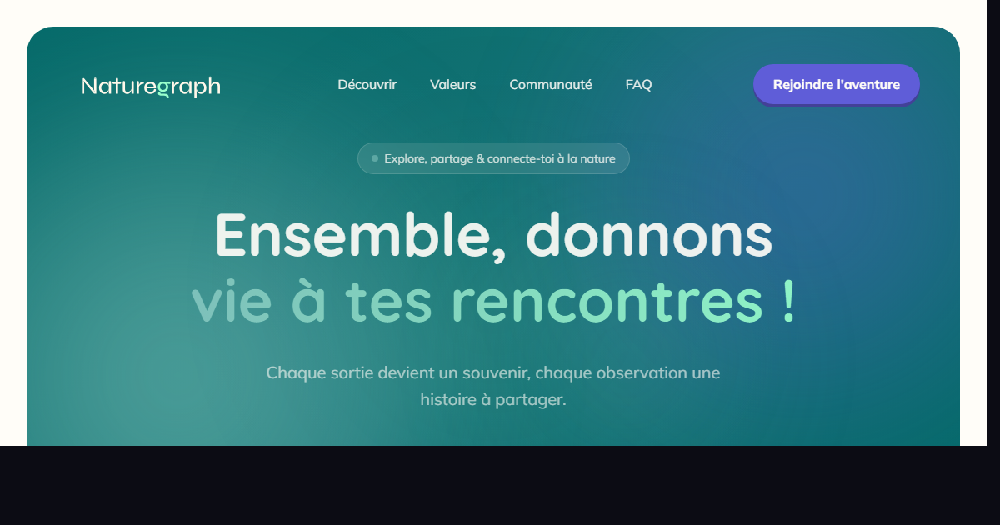

# Naturegraph

> Explorez, documentez et partagez la biodiversité.

Application web permettant aux naturalistes et passionnés de nature de documenter leurs sorties, partager leurs observations et rejoindre une communauté engagée pour la biodiversité.



---

## Stack technique

| Couche     | Technologie                              |
| ---------- | ---------------------------------------- |
| Framework  | React 19 + TypeScript                    |
| Build      | Vite 7                                   |
| Style      | Tailwind CSS 4 + SCSS (architecture 7-1) |
| Animations | Motion/React v12                         |
| Routing    | React Router v7                          |
| Données    | Supabase + TanStack Query v5             |
| i18n       | react-i18next (FR / EN)                  |
| Icônes     | Lucide React                             |
| Tests      | Vitest + Testing Library                 |
| Qualité    | ESLint + Prettier + Husky + lint-staged  |

---

## Démarrage rapide

```bash
# Installer les dépendances
npm install

# Lancer le serveur de développement (http://localhost:5173)
npm run dev

# Build de production
npm run build

# Prévisualiser le build
npm run preview
```

---

## Scripts disponibles

| Commande                | Description                          |
| ----------------------- | ------------------------------------ |
| `npm run dev`           | Serveur de développement avec HMR    |
| `npm run build`         | Build TypeScript + Vite (production) |
| `npm run preview`       | Prévisualisation du build            |
| `npm run lint`          | Audit ESLint                         |
| `npm run format`        | Formatage Prettier                   |
| `npm run test`          | Tests unitaires (run once)           |
| `npm run test:watch`    | Tests en mode watch                  |
| `npm run test:coverage` | Rapport de couverture                |

---

## Structure du projet

```
src/
├── assets/
│   ├── images/          # Photos et illustrations (hero, features, etc.)
│   └── logos/           # Logos Naturegraph (SVG, variantes)
├── components/          # Composants réutilisables
├── i18n/
│   └── locales/         # Traductions fr.json / en.json
├── pages/
│   ├── Landing/         # Landing page (sections autonomes)
│   │   ├── Hero.tsx
│   │   ├── FeaturesCards.tsx
│   │   ├── ProductFeatures.tsx
│   │   ├── Storytelling.tsx
│   │   ├── Mission.tsx
│   │   ├── Values.tsx
│   │   ├── Partners.tsx
│   │   ├── Discord.tsx
│   │   ├── FAQ.tsx
│   │   ├── CTABanner.tsx
│   │   ├── Footer.tsx
│   │   ├── Navbar.tsx
│   │   ├── landing.css  # Tokens, animations, utilitaires landing
│   │   └── index.tsx
│   ├── Contact.tsx
│   ├── Privacy.tsx
│   ├── Legal.tsx
│   ├── Signup.tsx
│   ├── Login.tsx
│   ├── Onboarding.tsx
│   └── ...
├── styles/              # Design system SCSS 7-1
│   ├── abstracts/       # Variables, tokens, mixins
│   ├── base/            # Reset, typography
│   └── ...
├── router.tsx           # Routes avec lazy loading
├── App.tsx
└── main.tsx

public/
├── hermine-icon.png     # Favicon + apple-touch-icon
└── og-preview.png       # Image Open Graph (1200×630)

scripts/
└── og-screenshot.mjs    # Génère og-preview.png depuis le dev server
```

---

## Pages et routes

| Route         | Page                         |
| ------------- | ---------------------------- |
| `/`           | Landing page                 |
| `/signup`     | Inscription                  |
| `/login`      | Connexion                    |
| `/verify`     | Vérification du code         |
| `/onboarding` | Onboarding                   |
| `/home`       | Accueil app                  |
| `/explore`    | Explorer                     |
| `/profile`    | Profil                       |
| `/contact`    | Contact                      |
| `/privacy`    | Politique de confidentialité |
| `/legal`      | Mentions légales             |

---

## Internationalisation

Les traductions sont dans `src/i18n/locales/` :

- `fr.json` — Français (langue par défaut)
- `en.json` — Anglais

Le switcher FR/EN est intégré (fonctionnel) mais masqué en production dans l'attente d'une traduction complète.

---

## Qualité et accessibilité

- **WCAG AA** — focus-visible sur tous les éléments interactifs, skip link, attribut `lang`
- **Éco-conception** — `loading="lazy"` sur toutes les images hors-fold, bundle JS ~181 KB gzip
- **Animations** — respectueuses de `prefers-reduced-motion`
- **Pre-commit hook** — ESLint + Prettier via Husky + lint-staged (bloque les commits avec erreurs)

---

## SEO

Le fichier `index.html` contient :

- `<title>` et `meta description` optimisés
- Balises **Open Graph** complètes (Facebook, WhatsApp, LinkedIn)
- **Twitter/X Card** `summary_large_image`
- `canonical`, `robots`, `theme-color`
- Favicon `hermine-icon.png` + `apple-touch-icon`

Pour régénérer l'image OG après modification du hero :

```bash
# Avec le dev server lancé (npm run dev)
node scripts/og-screenshot.mjs
```

---

## Variables d'environnement

Créer un fichier `.env.local` à la racine :

```env
VITE_SUPABASE_URL=your_supabase_url
VITE_SUPABASE_ANON_KEY=your_supabase_anon_key
```

---

## Branches

| Branche   | Rôle                             |
| --------- | -------------------------------- |
| `main`    | Production                       |
| `develop` | Intégration (branche de travail) |

---

## Partenaires

Naturegraph est soutenu par [Paloume](https://paloume.org), [Hub Environnement](https://hub-environnement.fr), [Wazoom](https://wazoom.fr) et [Kreapulse](https://kreapulse.fr).
